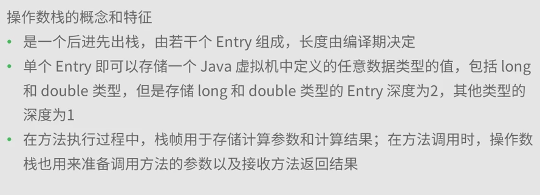

# JVM_Note
---
###Tips

**Oracle HotSpot**  
*共有设计，私有实现 不同的虚拟机相同的效果*  

>

**虚拟机运行时数据区** 

- java堆
- java虚拟机栈
- 本地方法栈
- 方法区
- 程序计数器  

>

###栈
*java虚拟机栈特征*  

- 线程私有
- 后进先出（LIFO）
- 存储栈帧
- out of memory error/stack overflow error

*java虚拟机本地方法栈特征*  

- 线程私有
- 后进先出（LIFO）
- 存储栈帧
- out of memory error/stack overflow error
- 有些虚拟机将虚拟机栈和本地方法栈合并实现

>
*局部变量*  
>
*操作数栈*  
>
*演示*  
>

>

*栈异常*  

- 栈容量深度

>

- OOM异常

>

###堆

*堆特征*  
>
*堆与栈的关联*    
>

*java堆内存溢出*  
>

*方法区*  
>
*运行时常量池*  
>

*直接内存*    
>
